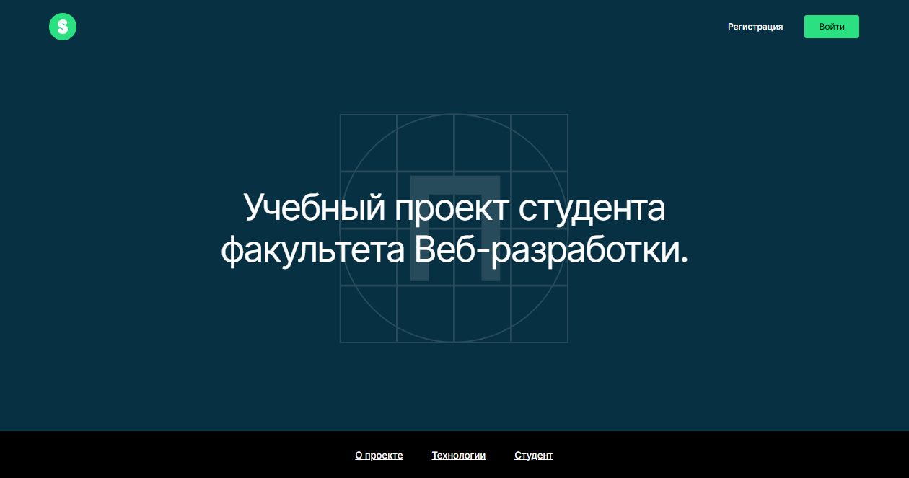

# movies-explorer-frontend

### Макет
> https://www.figma.com/file/0ktHTmdmsBZtlEAyScINjy/Diploma-(Copy)?type=design&node-id=999%3A6564&mode=dev

### Деплой
> https://andrei-eth.nomoredomains.rocks

### Запуск проекта
`npm i`
`npm start`

## `frontend/`
- [x] Функционал на Реакте (CRA)
- [x] Запросы к API, аутентификация пользователя, защищённые роуты, хуки, контекст
- [x] Вёрстка из Фигмы
- [x] Использованы css-переменные
- [x] Использованы Flex и Grid для построения сеток и выравнивания
- [x] Использованы @media для адаптации под разные разрешения экрана
- [x] Подключены шрифты через @font-face
- [x] Стили по БЭМ

## `backend/`
- [x] настройка инфраструктуры проекта (editorconfig, линтер, etc.)
- [x] база данных на MongoDB
- [x] разворачивание бэкенда на удалённой машине (pm2, nginx)
- [x] обработка ошибок
- [x] проверка токенов
- [x] регистрация и авторизация пользователей
- [x] изменение профиля
- [x] сохранение/удаление карточки

